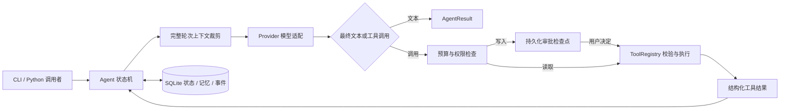
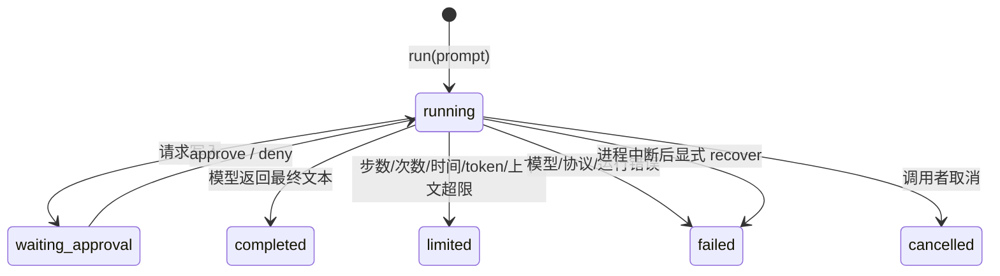

# 架构与运行状态

Agent 的能力来自模型、可用工具、外部状态以及控制循环的组合。这个项目把这些职责拆开，任何模型都只能提出 `ToolCall` 意图，不能直接执行 Python 或文件操作。

## 数据协议

- `Message` 表达角色和内容；assistant 消息可以包含多个 `ToolCall`。
- `ToolCall` 包含名字、JSON 参数和 ID。工具响应使用同一个 ID 回传。
- `ModelResponse` 包含文本、工具调用和 `Usage`，由 Provider 返回。
- `AgentResult` 包含状态、最终输出、会话/运行 ID、步数、工具次数和等待操作。

一次计算的消息顺序是 `user → assistant(tool_calls) → tool → assistant(answer)`。多工具响应会依次出现多条 tool 消息。上下文裁剪以完整 user turn 为单位，避免单独保留工具响应却丢掉对应的 assistant 调用。

`session_id` 标识持续对话；`run_id` 标识其中一个用户任务。审批后的继续沿用原 run ID，模型/工具预算继续累计。新的用户任务沿用会话历史，重新分配该轮预算。持久化保存完整消息；裁剪只影响发给模型的当前上下文。

## 状态与转移

工具异常通常转换成 `{"ok": false, "error": ...}`，由模型决定是否修正参数继续。Provider 无法完成请求或返回不符合协议的数据时，该轮失败。`completed` 表示模型完成回复，并不保证任务事实正确；评测需要另外判断内容与轨迹。

## 审批为什么放在执行前

每次模型提出写入后，先保存完整调用参数，再返回 `waiting_approval`。用户能够查看具体路径、内容或记忆值。恢复只能批准当前检查点的调用 ID，未选中的写入被拒绝；新调用不能复用旧批准。执行环境也会与检查点进行比较。

执行工具前保存 `in_flight`，执行完成后先追加工具结果、移除 pending，再保存检查点。若进程恰好在外部副作用发生后、保存结果前退出，系统无法确定操作是否完成。因此 `recover` 保守结束该轮，要求使用者核对副作用，不声称 exactly-once。

会话租约使协作使用此 API 的进程不能同时推进同一个会话。租约有效期覆盖配置的运行预算并留出余量；正常退出主动释放，崩溃后到期释放。它是本地协作约定，直接改 SQLite 或不遵守 API 的代码可以绕开它。

## 多 Agent 与规划

多 Agent 不是把所有消息放进同一个上下文。示例给计算员和研究员不同工具注册表，每人使用独立会话，通过工作流节点输出传递结果。

`Workflow` 管理静态 DAG；`Planner.plan()` 让模型生成受限 JSON 计划，再校验依赖；`Planner.execute()` 把计划转换成 DAG。每一步由调用方传入的 runner 实现，因此计划不能自行增添工具权限或执行代码。

Planner 的 JSON 修复次数和响应长度有界。计划的 Schema 校验之后还要验证不存在循环与缺失依赖。工作流失败会跳过依赖分支，独立分支继续执行。重试默认关闭，只有幂等任务才应开启。

## 观测与隐私

事件记录模型请求开始/结束、工具执行开始/结束、审批和最终状态，不记录或展示模型的隐藏推理。消息、写入参数、文档和最终输出会保存在本机 SQLite 中；它不是加密存储。Key 仅用于 Provider 的 HTTP 请求，不写入会话身份。把自己的敏感数据送入在线模型前，应理解消息与工具结果都会进入请求。
